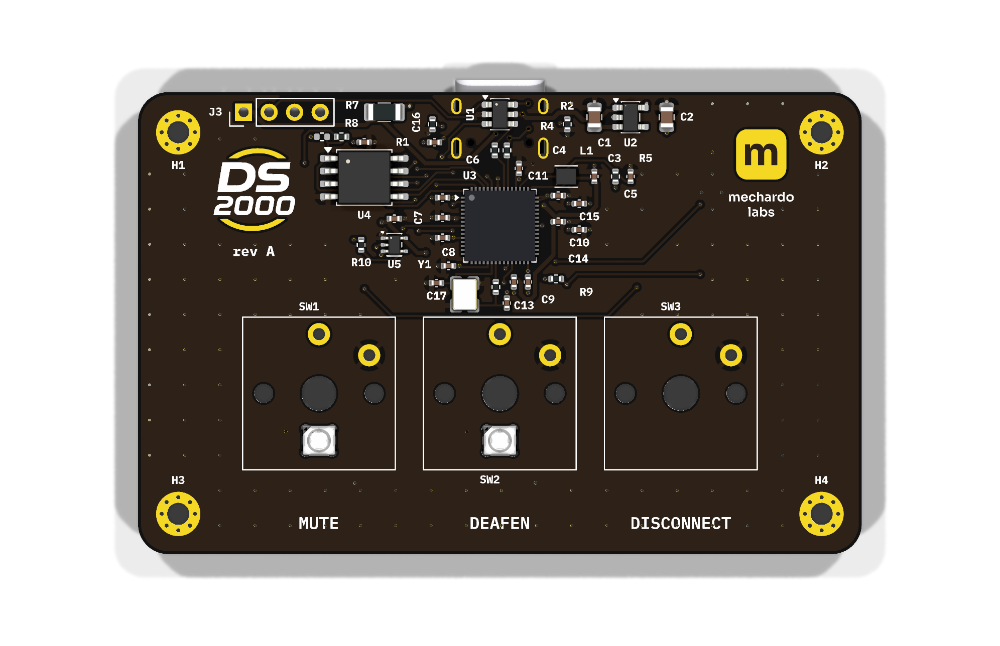
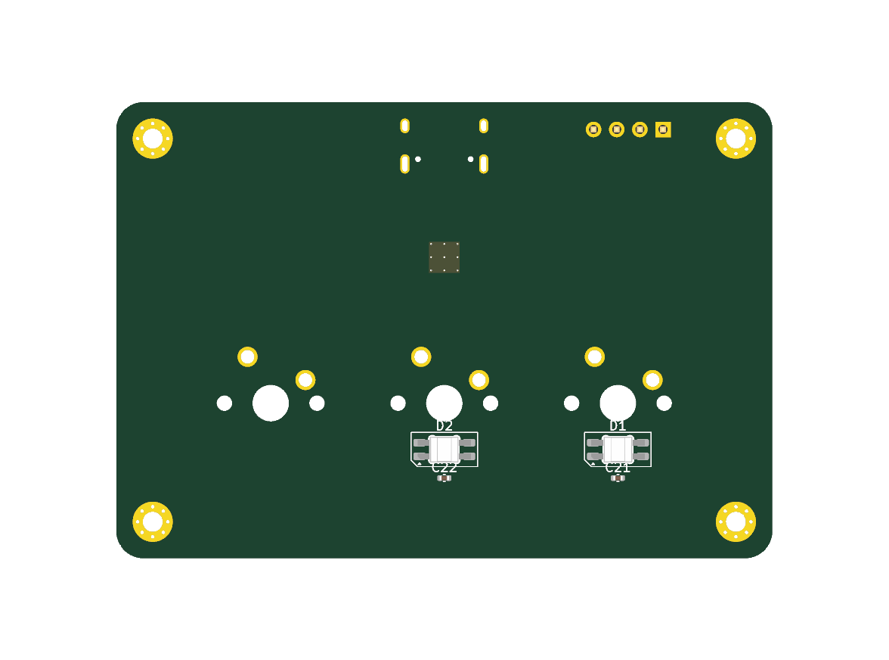
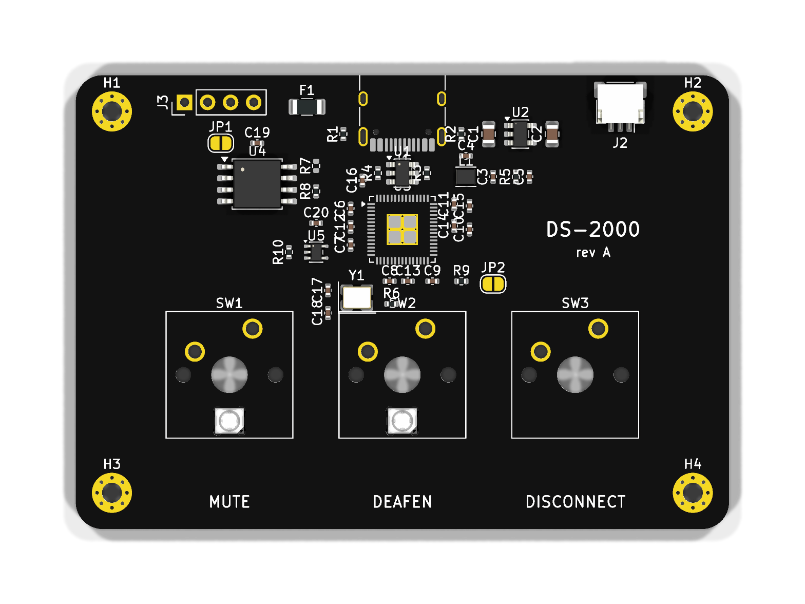
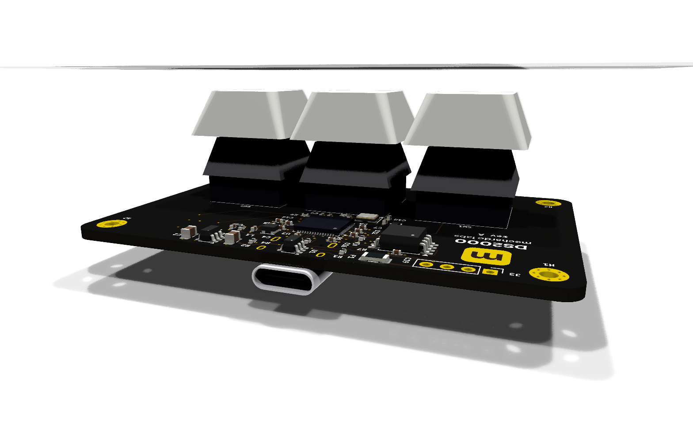
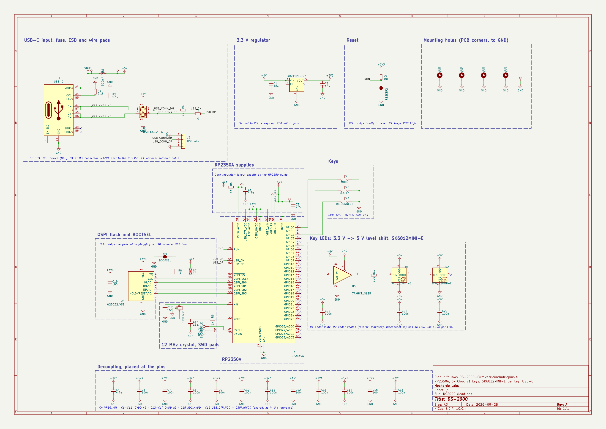

# DS-2000 PCB

KiCad design for the DS-2000, a three-key Discord control deck: mute, deafen and disconnect. Mute
and deafen are lit from underneath by an RGB LED; disconnect has none. The board is also the device's visible top face; it sits in a
3D-printed tray.

| | |
|---|---|
| MCU | Raspberry Pi RP2350A |
| Keys | 3× Kailh Choc V1 (low profile) in a row, 18 mm pitch, soldered |
| LEDs | 2× SK6812MINI-E, reverse-mounted under the mute and deafen keys |
| Connector | USB-C (USB 2.0 full speed), or a cable soldered to J3 |
| Board | 4 layers, 1.6 mm, 72 × 46 mm, black mask, ENIG. RP2350A on show on top; USB-C, LEDs and debug pads underneath |
| Tool | **KiCad 10** |


Design decisions, block descriptions, BOM and open items: [`docs/design-rev-a.md`](docs/design-rev-a.md).

## Gallery

| Top face, without switches | Underneath |
|---|---|
|  |  |
| The visible face: RP2350A, logos and legends. The LEDs show through the Choc cut-outs | USB-C at the back edge, SK6812MINI-E under mute and deafen, debug pads (SWD, BOOT, RST) |

| With switches and keycaps | From the back |
|---|---|
|  |  |

### Schematic

[](docs/img/schematic.png)

One sheet, one box per block: USB-C input, 3.3 V regulator, RP2350A supplies, QSPI flash, crystal
and SWD, keys, and the LED chain with its 5 V level shifter.

## Pinout

The pinout is defined by the firmware (`DS-2000-Firmware/include/pins.h`). Change it there first.

| Function | GPIO |
|---|---|
| Mute key | GP0 |
| Deafen key | GP1 |
| Disconnect key | GP2 |
| LED data (SK6812 chain, via 5 V level shifter) | GP5 |

## Checks

```sh
kicad-cli sch erc --severity-all DS2000.kicad_sch
kicad-cli sch export netlist --format kicadsexpr -o /tmp/ds2000.net DS2000.kicad_sch
```

## Related repositories

- [DS-2000](https://github.com/Mechanix97/DS-2000): desktop application
- [DS-2000-Firmware](https://github.com/Mechanix97/DS-2000-Firmware): firmware
- [DS2000-Enclosure](https://github.com/Mechanix97/DS2000-Enclosure): enclosure (Fusion 360)

## License

AGPL-3.0, see [`LICENSE`](LICENSE). Whether the hardware should move to CERN-OHL-S is discussed
in #16.
