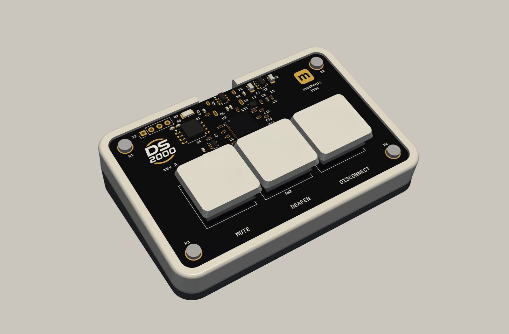
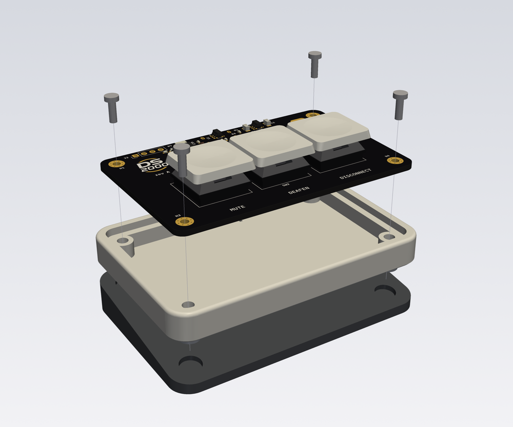
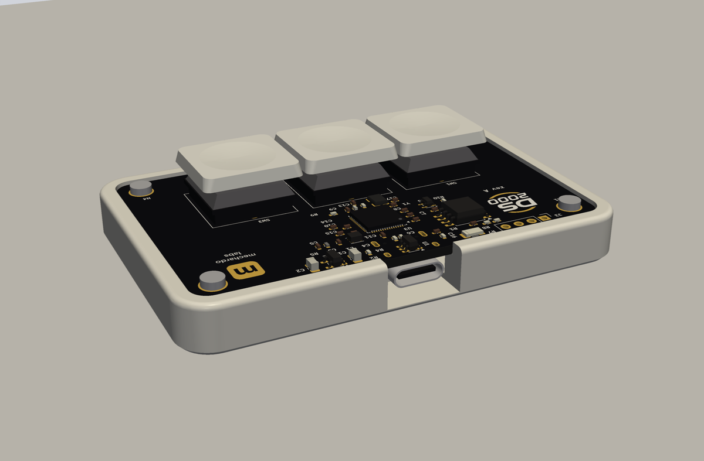
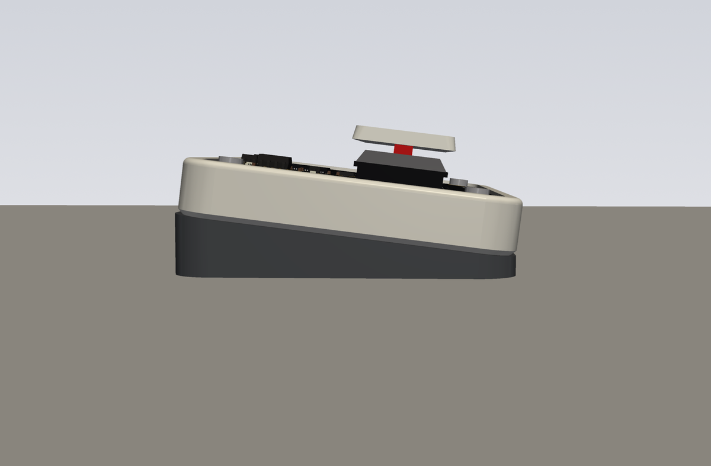
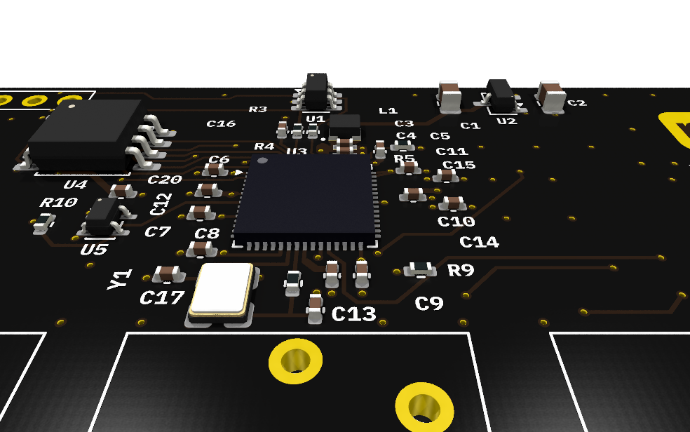
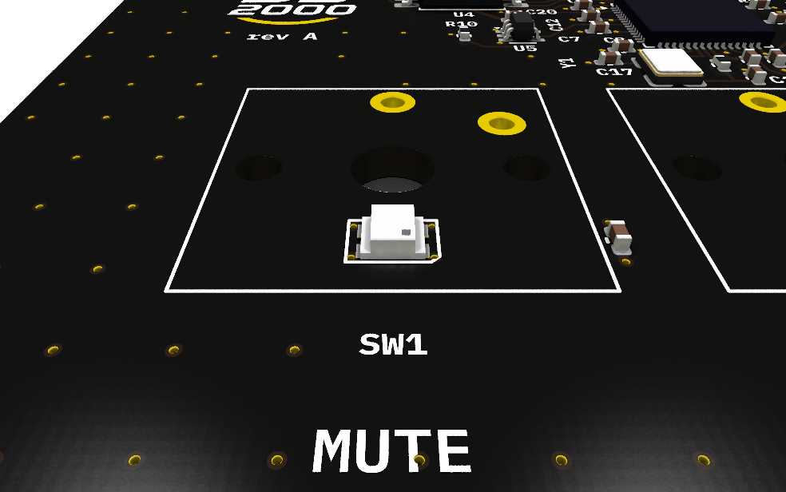
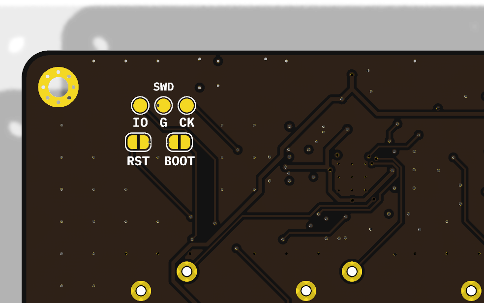
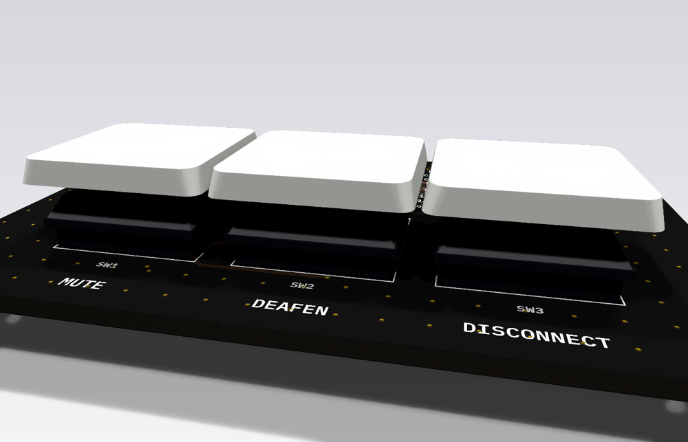

<p align="center">
  
</p>

<p align="center">
  
</p>

<h1 align="center">DS2000 PCB</h1>

<p align="center">
  <b>Three keys for Discord: mute, deafen, disconnect.</b><br>
  RP2350A · Kailh Choc V1 · RGB inside the switch · soldered USB cable · the board <i>is</i> the top face
</p>

KiCad design for the DS2000, a three-key Discord control deck. Mute and deafen are lit from
underneath by an RGB LED; disconnect has none. The board is also the device's visible top face: the
RP2350A, the logos and the legends are meant to be seen. It sits in a 3D-printed tray
([DS2000-Enclosure](https://github.com/Mechanix97/DS2000-Enclosure)).

| | |
|---|---|
| MCU | Raspberry Pi RP2350A |
| Keys | 3× Kailh Choc V1 (low profile) in a row, 18 mm pitch, soldered, MBK-style caps |
| LEDs | 2× WS2812B-2020, on top inside the LED window of the mute and deafen switches |
| Connector | A USB cable (USB 2.0 full speed) soldered to J3; no receptacle |
| Board | 4 layers, 1.6 mm, 72 × 46 mm, black mask, ENIG. Every part on top (one-sided assembly), RP2350A on show; only debug pads underneath |
| Tool | **KiCad 10** |

Design decisions, block descriptions, BOM and open items: [`docs/design-rev-a.md`](docs/design-rev-a.md).

## In its enclosure

The same frame-style tray works flat on the desk or on a separate 7° wedge, held by magnets. The
board screws into it through its four corner holes.

<table>
  <tr>
    <td width="50%"></td>
    <td width="50%">
      <br>
      
    </td>
  </tr>
  <tr>
    <td>Exploded: four M2 screws, the board, the tray and the 7° wedge</td>
    <td>Flat, with the USB-C leaving straight back; and on the wedge, from the side</td>
  </tr>
</table>

## The board

| Top face, without switches | Underneath |
|---|---|
|  |  |
| The visible face: RP2350A, logos and legends | No parts: debug pads (SWD, BOOT, RST) and J3's cable holes |

### Close up

| | |
|---|---|
|  |  |
| **RP2350A on show**, with the flash, the 12 MHz crystal and the core regulator around it | **Light inside the switch**: the WS2812B-2020 sits in the Choc's LED window (switch hidden here); its 100 nF hides under the keycap |
|  |  |
| **Underneath**: only the debug pads, so JLC assembles one side | **Low profile**: Choc V1 with flat caps, keycap tops ~8.7 mm above the board |

<details>
<summary>More views</summary>

| With switches and keycaps | From the back |
|---|---|
|  |  |


</details>

### Schematic

[](docs/img/schematic.png)

One sheet, one box per block: USB input (soldered cable) and ESD, 3.3 V regulator, RP2350A supplies, QSPI flash, crystal
and SWD, keys, and the LED chain with its 5 V level shifter.

## Pinout

The pinout is defined by the firmware (`DS2000-Firmware/include/pins.h`). Change it there first.

| Function | GPIO |
|---|---|
| Mute key | GP0 |
| Deafen key | GP1 |
| Disconnect key | GP2 |
| LED data (WS2812B chain, via 5 V level shifter) | GP5 |

## Checks

```sh
kicad-cli sch erc --severity-all DS2000.kicad_sch
kicad-cli sch export netlist --format kicadsexpr -o /tmp/ds2000.net DS2000.kicad_sch
```

CI (KiBot) runs ERC and DRC with schematic parity on every change and fails on any new error.

## Manufacturing

Every change also builds the files to order the board from JLCPCB, with assembly (artifact
`kibot-out` of the KiBot workflow):

- `JLCPCB/`: gerbers and drill (zipped), BOM with LCSC numbers, placement (CPL) with JLC's rotation fixes
- `step/`: the populated board as STEP, origin at its centre, for the [enclosure](https://github.com/Mechanix97/DS2000-Enclosure)

Board options, parts and what to check before ordering: [`docs/design-rev-a.md`](docs/design-rev-a.md#bill-of-materials).

## Related repositories

- [DS2000](https://github.com/Mechanix97/DS2000): desktop application
- [DS2000-Firmware](https://github.com/Mechanix97/DS2000-Firmware): firmware
- [DS2000-Enclosure](https://github.com/Mechanix97/DS2000-Enclosure): enclosure (Fusion 360)

## License

AGPL-3.0, see [`LICENSE`](LICENSE). Whether the hardware should move to CERN-OHL-S is discussed
in #16.
