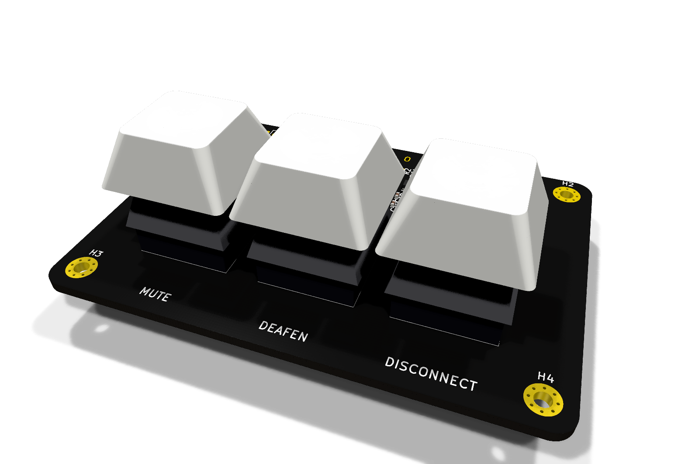

# DS-2000 rev A — design notes

Rev A replaces the 2025 RP2040 draft (last seen at commit `7db9552`). It was drawn from scratch,
using the draft only as a reference, and fixes every defect found in it (DS2000-PCB#2-#10).

## Product decisions

| Decision | Choice | Why |
|---|---|---|
| MCU | Discrete **RP2350A** (QFN-60) | Same family as the RP2350-Zero test module the firmware runs on |
| Look | **Exposed PCB as the top face**, enclosure is a tray underneath | The board is the product's face: logo, art, legends in silkscreen |
| Top side | Switches, and **the RP2350A and its circuitry on show** in a strip behind the keys | The visible chip is part of the look |
| Bottom side | The two reverse-mount LEDs and the **USB-C receptacle** | The plug and cable sit low, level with the tray, and the top strip gains space. Assembly is two-sided |
| Layers | 4 (Sig / GND / PWR / Sig), 1.6 mm | Routes mostly on inner layers so the face stays clean, solid reference for USB and the core regulator, stiff enough to hold switches without a plate |
| Finish (proposed) | Matte black soldermask, ENIG | Gold for exposed logo copper and mounting rings |
| Keys | 3× Cherry MX, **soldered, no plate**, in a row | Footprint drilled for 5-pin (PCB-mount); 3-pin switches also fit. 5-pin is steadier without a plate |
| Size | ~72 × 50 mm | 3 × 19.05 mm keys plus corner M2 holes; the extra depth is the component strip behind the keys |
| Status | **SK6812MINI-E** reverse-mount under the mute and deafen keys; **disconnect has no LED** | Lights the key through the switch LED window; needs shine-through or translucent keycaps |
| Pinout | Owned by `DS-2000-Firmware/include/pins.h` | See below |

## Blocks

**USB-C and power.** HRO TYPE-C-31-M-12 on the **bottom** side at the back edge, pointing backwards, so the plug and cable sit low and the top strip stays free. The tray needs a pocket of at least 4 mm under the board and a cut-out in its back wall for the plug overmould (about 12.5 × 6.5 mm). J3 is four bare 2.54 mm holes (VBUS, D-, D+, GND) to solder a USB cable instead of fitting J1; it sits upstream of the fuse and ESD, so a soldered cable is protected the same way. 5.1 kΩ on CC1/CC2
(UFP). VBUS goes through F1 (500 mA hold PTC) to `+5V`, which feeds the LEDs and the level shifter.
USBLC6-2SC6 ESD on D+/D- close to the connector. AP2112K-3.3 LDO (250 mV dropout, 600 mA) makes
`+3V3`; the RP2350 minimal design uses an NCP1117, but its ~1.1 V dropout leaves little margin from
a 4.75 V VBUS after the fuse.

**RP2350A.** Straight from *Hardware design with RP2350* (Minimal design, R4):

- Core supply from the on-chip switching regulator: `VREG_LX` → L1 3.3 µH → `+1V1` (DVDD ×3 and
  `VREG_FB`), C3 4.7 µF output, C4 4.7 µF on `VREG_VIN`, `VREG_AVDD` through R5 33 Ω / C5 4.7 µF.
  **L1 must be the polarity-marked Abracon AOTA-B201610S3R3-101-T, placed in the orientation and
  layout the guide shows.** Raspberry Pi explicitly says other layouts are at your own risk.
- `VREG_PGND` to GND, routed as the guide describes (not to an arbitrary via).
- 100 nF per power pin: C6-C11 IOVDD, C12-C14 DVDD, C15 ADC_AVDD, C16 shared by USB_OTP_VDD and
  QSPI_IOVDD (as in the reference).
- Crystal ABM8-272-T3 12 MHz, 15 pF load caps, 1 kΩ on XOUT. Do not substitute.
- USB 27 Ω series resistors R3/R4 close to the chip; D+/D- as a 90 Ω differential pair over
  unbroken GND.
- Flash W25Q32JVSSIQ (4 MB, same size as the RP2350-Zero, so the firmware image is identical).
  R7 (10 kΩ CS pull-up) is DNP as in the reference.
- BOOTSEL: no button. JP1 is a pair of bare pads (open solder jumper) that pull `QSPI_SS` low through
  R8 1 kΩ when bridged with tweezers or a wire while USB is plugged in (or RESET pressed).
  RESET: likewise pads, JP2, from `RUN` to GND; R9 10 kΩ keeps `RUN` high. Firmware updates do not
  need either: the running firmware reboots itself into USB boot (DS-2000-Firmware#14, #15; DS-2000#35).
- SWD on J2, JST-SH 3-pin in the Raspberry Pi Debug Probe pinout (SWCLK, GND, SWDIO).

**Keys and LEDs.** SW1-SW3 to GPIO0-2 and GND; the firmware uses the internal pull-ups (not
affected by the RP2350-E9 erratum, which concerns pull-downs). The LED data line leaves GPIO5 at
3.3 V and is shifted to 5 V by U5 (74AHCT1G125, TTL-level input), then R10 100 Ω, then the chain
D1 (mute) → D2 (deafen); D2's DOUT is unused. Each LED has its own 100 nF. SK6812 data input needs
0.7 × VDD = 3.5 V at 5 V, which a 3.3 V GPIO does not guarantee; hence the shifter.

## Pinout

| Function | GPIO | Net |
|---|---|---|
| Mute key | GP0 | `KEY_MUTE` |
| Deafen key | GP1 | `KEY_DEAFEN` |
| Disconnect key | GP2 | `KEY_DISCONNECT` |
| LED data (to U5) | GP5 | `LED_DIN_3V3` |

**Firmware impact** (tracked in Mechanix97/DS-2000-Firmware#13): the six PWM LED pins (GP5-GP10) are gone. The firmware needs a
WS2812/SK6812 driver on GP5 (arduino-pico ships `Adafruit_NeoPixel`-compatible PIO drivers), and
`pins.h` changes accordingly. The serial protocol does not change: it already carries a colour for
each of the two status LEDs, which map one-to-one onto D1 and D2.

## Bill of materials

Generated from the schematic (`kicad-cli sch export bom`). LCSC part numbers are still to be added
(DS2000-PCB#13).

| Refs | Value | MPN | Footprint |
|---|---|---|---|
| U3 | RP2350A | RP2350A | QFN-60 7×7 mm, thermal vias |
| U4 | Flash 4 MB | W25Q32JVSSIQ | SOIC-8 5.3 mm |
| Y1 | 12 MHz | ABM8-272-T3 | 3225 4-pin |
| L1 | 3.3 µH | AOTA-B201610S3R3-101-T | 2016 metric (see open items) |
| U2 | 3.3 V LDO | AP2112K-3.3TRG1 | SOT-23-5 |
| U1 | USB ESD | USBLC6-2SC6 | SOT-23-6 |
| U5 | Buffer, TTL in | 74AHCT1G125GW | SOT-353 |
| D1, D2 | RGB LED | SK6812MINI-E | reverse mount 3.2×2.8 |
| J1 | USB-C 16P | HRO TYPE-C-31-M-12 | |
| J2 | SWD | JST SM03B-SRSS-TB | JST-SH 1×3 horizontal |
| J3 | USB wire holes, not in BOM | — | 1×4 2.54 mm holes |
| F1 | PTC 500 mA hold | Littelfuse 1206L050YR | 1206 |
| SW1-SW3 | Keys | Cherry MX compatible | MX 1u PCB |
| JP1, JP2 | BOOTSEL and RESET pads, not in BOM | — | open solder jumper, 1.3 mm pitch |
| C1, C2 | 10 µF | | 0805 |
| C3-C5 | 4.7 µF | | 0402 |
| C6-C16, C19-C22 | 100 nF | | 0402 |
| C17, C18 | 15 pF C0G | | 0402 |
| R1, R2 | 5.1 kΩ | | 0402 |
| R3, R4 | 27 Ω | | 0402 |
| R5 | 33 Ω | | 0402 |
| R6, R8 | 1 kΩ | | 0402 |
| R7 | 10 kΩ, **DNP** | | 0402 |
| R9 | 10 kΩ | | 0402 |
| R10 | 100 Ω | | 0402 |
| H1-H4 | M2 plated hole to GND | | |

## Layout

The board was started by `tools/pcb-generator/gen_pcb.py`, which loads footprints, nets and symbol
links from the schematic's netlist, so **Update PCB from Schematic (F8) reports no changes** and DRC's
schematic-parity check is clean. From here the `.kicad_pcb` is edited by hand.

**Fixed (mechanical, agreed with the enclosure):**

| Item | Position |
|---|---|
| Outline | 72 × 50 mm, 3 mm corner radius |
| Keys | row of 3 at 19.05 mm pitch, centres 17 mm from the front edge, middle key on the board's centre line |
| LEDs | D1/D2 on the bottom, 5.08 mm south of the switch centre (the MX LED window, opposite the switch pins) |
| Holes | 4 × M2, 4 mm in from each edge, clear of the keycaps |
| USB-C | bottom side, centred on the back edge, mating face flush, opening facing back |
| SWD (J2) | back edge, right, opening facing back |
| USB wire holes (J3) | back edge, left |

**Starting positions only:** everything in the strip between the keys and the back edge, grouped
around the RP2350A by function. Expect to move all of it.

**3D models:** KiCad's library has no STEP for the MX switch, the HRO USB-C or the QFN-60, so
`tools/3d-models/gen_models.py` generates simplified ones from datasheet dimensions into
`3dmodels/DS2000.3dshapes/` (referenced through `${KIPRJMOD}`, so they travel with the project). The
switches also carry a 1u keycap model for previews and for fitting the enclosure.

**Stackup and rules:** JLCPCB JLC04161H-7628, 4 layers, 1.6 mm, black mask, white silk, ENIG.
In1 is a GND plane, In2 a +3V3 plane, B.Cu a GND pour. Minimums set for JLC: 0.1 mm track and
clearance, 0.2 mm drill, 0.3 mm copper to edge (0.2 mm only for the LED cut-outs, in
`DS2000.kicad_dru`). Net classes: *Power* (GND, +5V, +3V3, +1V1, VBUS, VREG_LX) 0.4 mm, *USB* 0.2 mm
tracks / 0.2 mm gap as a starting point for 90 Ω; confirm with JLC's impedance calculator for this
stackup before routing.

**When placing and routing:**

- Core regulator (L1, C3, C4, R5, C5 and VREG_PGND) copied from the RP2350 minimal design's layout,
  inductor orientation included. This is the one area not to improvise.
- Crystal, R6, C17, C18 tight against XIN/XOUT; nothing else routed under the crystal.
- Decoupling caps at their pins; C16 serves both USB_OTP_VDD and QSPI_IOVDD.
- U1 (ESD) next to J1, R3/R4 next to the RP2350; D+/D- as a pair over unbroken GND.
- Keep the visible face tidy: route on the inner layers and B.Cu where possible.
- Under the keycaps (outside each switch's 14 mm housing) parts are hidden but must stay under
  ~2 mm high so a fully pressed keycap clears them.
- Confirm the LED side against your switches: the footprint assumes the LED window is on the side
  opposite the two switch pins, which is standard for MX.

## Open items

- [ ] Routing (#11); outline, keys and holes are fixed, see Layout
- [ ] L1 footprint: `L_Murata_DFE201610P` is a stand-in with the same 2.0×1.6 mm body. Check its
      pads against the Abracon datasheet or draw a dedicated footprint
- [ ] Mute and deafen keycaps must be shine-through or translucent for their LEDs to be visible
- [ ] LCSC numbers for every line, preferring JLCPCB basic parts (#13)
- [ ] Silkscreen art and logo for the visible face (mask black and ENIG are set)

## Regenerating the schematic

`tools/schematic-generator/gen_sch.py` produced the first version of `DS2000.kicad_sch`: one titled
box per stage, wired inside each stage, net labels only between stages. `check_netlist.py` compares
KiCad's netlist export with the connectivity declared in the generator; both it and ERC (0
violations) passed. From here on,
**the `.kicad_sch` is the source of truth**: edit it in KiCad. The generator is kept only as a
record of how the first version was derived.
